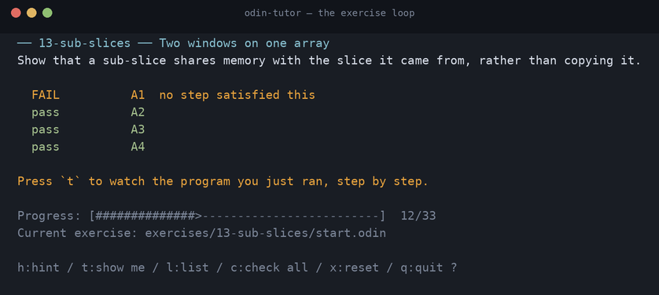
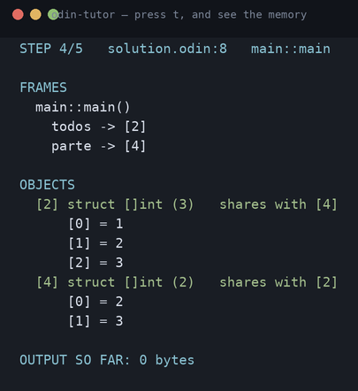
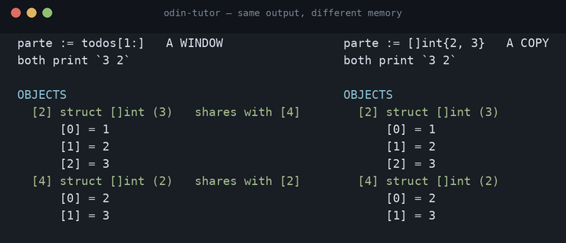
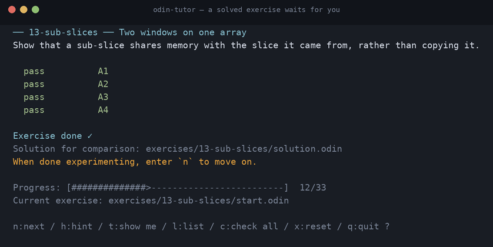
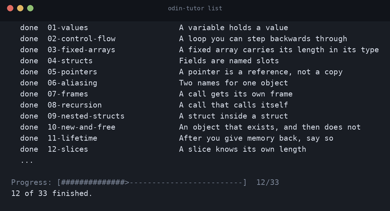

# odin-tutor

[](https://github.com/jpierreribeiro/odin-tutor/actions/workflows/check.yml)
[](https://github.com/jpierreribeiro/odin-tutor/actions/workflows/nightly.yml)

## Your program printed the right answer. It is still wrong. Here is why.

Thirty-three tiny broken Odin programs. Fix them, and watch your own memory
while you do.

Every other exercise runner can tell you *that* you are wrong. This one runs
your program under a debugger, records what happened, and shows you **the step
where it went wrong** — the frames, the variables, which pointer pointed where.

**Recommended in parallel with the [official Odin overview](https://odin-lang.org/docs/overview/).**
The overview explains the language; these make you write it.



Press `t`, and the picture opens at the step that decided it:



This project is directly inspired by [rustlings](https://github.com/rust-lang/rustlings)
and [ziglings](https://codeberg.org/ziglings/exercises). The loop is theirs. The
picture is what this one adds.

## Why a picture

Here are two solutions to the sub-slice exercise. **They print exactly the same
thing** — `3 2` — and one of them is wrong.

One takes a window onto an array. The other copies part of it. Every test that
compares printed output accepts both, so a normal exercise runner cannot tell
them apart, and neither can you from the output. The memory is not the same:



Same values. Same output. One says `shares with`, and that is the whole
difference: write through `parte` on the left and `todos` changes too.

`[2]` and `[4]` are identities, not addresses. Run it again with address
randomisation on and they are still `[2]` and `[4]`, because an address is a
fact about one run and this is teaching you about the program.

**All thirty-three exercises work this way**, and a check in the gate enforces
it: every wrong answer must be rejected by an assertion about MEMORY, never only
by its printed output. An exercise a plain test runner could catch does not need
this project.

## Who this is for

People learning Odin. You should have programmed before, in something — but no
experience with C, with manual memory management, or with "systems programming"
is assumed. If pointers, slices, and "who owns this memory" are the parts you
have never had to think about, that is exactly what the exercises are about.

The Odin language itself is documented at
[odin-lang.org/docs](https://odin-lang.org/docs/). The exercises assume you will
have that open beside them.

## What you need

| | |
|---|---|
| **Linux, x86-64** | On Windows, use WSL2. On macOS it builds and its tests pass, but it cannot trace yet — it needs a different debugger, and it tells you so instead of guessing ([why](docs/PLATFORM-SUPPORT.md#3-macos)). |
| **The Odin compiler** | A recent build from [odin-lang.org](https://odin-lang.org/). |
| **GDB, built with Python** | The default `gdb` package on Ubuntu and Fedora is. The tool runs its reader inside gdb. |

These exact combinations have been tested against the full probe suite:

| Odin | GDB | Platform |
|---|---|---|
| `dev-2026-08:9caff63` | GNU gdb 15.1 | Ubuntu 24.04, x86-64 |
| `dev-2026-07-nightly:819fdc7` | GNU gdb 15.0.50 | Ubuntu, x86-64 |

Anything else still runs. The tool checks your versions at startup and warns you
once if it has not seen them before, rather than pretending it knows.

Odin moves fast, and what this tool draws depends on the debug information your
compiler emits. So a job runs every night against the **three newest Odin
releases** — the whole test suite, every phase gate, and the probe suite that
asks whether the toolchain supports the model at all. If a release of Odin
breaks this, the failure has a date on it instead of turning up in your terminal
first.

## Getting started

```sh
git clone https://github.com/jpierreribeiro/odin-tutor.git
cd odin-tutor

export ODIN_ROOT=/path/to/Odin     # where you unpacked Odin
odin build src/tutor -out:odin-tutor

./odin-tutor preflight             # is your toolchain going to work?
```

`preflight` tells you what it found and stops here if something is missing, so
you find out now rather than in the middle of an exercise:

```
odin   dev-2026-07-nightly:819fdc7
gdb    GNU gdb (Ubuntu 15.0.50.20240403-0ubuntu1) 15.0.50.20240403-git
       built with Python, which the tracer runs inside

This combination is in the compatibility matrix, backed by a committed probe run.
```

Now make yourself a copy of the course and start:

```sh
./odin-tutor init ~/odin-course
cd ~/odin-course
odin-tutor
```

Name where you want it. Inside this clone you have to, because `odin-tutor` is
already the name of the executable you just built — from anywhere else, a plain
`odin-tutor init` creates `odin-tutor/` beside you.

You edit inside **your** directory. Nothing you do touches the repository you
cloned, so updating it later will not fight with your answers.

> **Tip:** so that `odin-tutor` works as a bare word from inside your course,
> put the checkout on your `PATH` — `export PATH="$PWD:$PATH"` from the clone,
> or add it to your shell profile. The tool finds its debugger script next to
> its own executable, so keep the two together.

## Using it

`odin-tutor` takes no arguments. It picks the first exercise you have not
finished, tells you which file to open, and re-runs it every time you save. You
never type an exercise name.

Under every screen:

```
Progress: [#####>----------------------------------]  2/33
Current exercise: exercises/03-fixed-arrays/start.odin

h:hint / t:show me / l:list / c:check all / x:reset / q:quit ?
```

| Key | |
|---|---|
| `t` | **Show me.** Opens the picture at the exact step your failing assertion was decided at. Arrow keys walk it, `g` jumps to a step, `q` comes back. |
| `h` | A hint for this exercise. Never shown unless you ask. |
| `n` | Move on. Appears only once the exercise passes. |
| `l` | The whole list, done and not done. |
| `c` | Check every exercise, not just this one. |
| `x` | Put this exercise back the way it started. |
| `q` | Stop. Your progress is remembered. |

A solved exercise does **not** vanish. It says so, points at the reference
solution so you can compare, and keeps watching your file until you press `n` —
because that is the one moment where the whole run is recorded and `t` is one
keypress away.



Your progress lives in your course directory. Two copies of the course do not
share a count, and deleting the directory deletes everything the tool kept.

## What the exercises cover

Each one accompanies a section of the
[official overview](https://odin-lang.org/docs/overview/).



| | |
|---|---|
| `01-values` | A variable holds the value you last put in it |
| `02-control-flow` | A loop runs its body once per iteration |
| `03-fixed-arrays` | A fixed array's length is part of its type, not a number beside it |
| `04-structs` | Fields are named slots, read individually |
| `05-pointers` | Writing through a pointer changes the thing it points at |
| `06-aliasing` | Two names for one object: a change through one shows through the other |
| `07-frames` | A call gets its own frame, and returns a value to its caller |
| `08-recursion` | Each invocation has its own frame, argument and return value |
| `09-nested-structs` | A struct field can be a struct, and the picture reads all the way down |
| `10-new-and-free` | `new` creates an object with an identity; `free` ends it |
| `11-lifetime` | A pointer to freed memory still looks like a pointer |
| `12-slices` | A slice carries its length beside its data |
| `13-sub-slices` | A sub-slice shares memory rather than copying it |
| `14-dynamic-arrays` | A dynamic array can hold room it is not using |
| `15-strings` | An Odin string is a view onto bytes |
| `16-utf8` | A string's length is in bytes, not characters |
| `17-enums` | The value is a name, not a slot number |
| `18-varargs` | Any number of arguments arrives as one slice |
| `19-arenas` | Allocating moves a mark; unused, it never moves |
| `20-errors` | Failure is returned, so the caller holds it |
| `21-or-return` | The error leaves on its own instead of becoming a zero |
| `22-string-copy` | Copying a string does not copy its bytes |
| `23-struct-copy` | Assigning a struct copies it; taking its address does not |
| `24-parameters` | A parameter is a copy until you pass a pointer |
| `25-in-place` | A by-reference loop changes the thing, not a copy of it |
| `26-sorting` | Sorting in place reorders the buffer everyone else can see |
| `27-unions` | A union holds one variant at a time, and knows which |
| `28-soa` | `#soa` stores one array per field, and the code does not change |
| `29-array-math` | `a + b` adds every element at once, with no index to get wrong |
| `30-swizzle` | `.zyx` builds a new array in the order you named |
| `31-defer` | `defer` gives the memory back from where you took it |
| `32-distinct` | Same bytes, same printed value, a type the compiler will not mix up |
| `33-maps` | A key you already have is not a second one |

**Twenty-two of the thirty-three print the same thing whether you are right or
wrong.** Their wrong answer passes every output assertion the exercise has, so
no amount of comparing printed text would catch it. Only the memory tells them
apart.

That count is measured by the acceptance script, not maintained by hand — an
earlier version of this paragraph said ten, and listed two exercises that did
not qualify.

More are planned. [`docs/CURRICULUM.md`](docs/CURRICULUM.md) maps every one to
its overview section — and lists what will **not** become an exercise, with the
reason for each. Unions and maps are not there because this tool cannot read
them honestly, and it says so rather than drawing something.

## Pointing it at your own program

The exercises are not the only thing it will read. Any Odin program works:

```sh
odin-tutor trace mine.odin trace.json   # compile, run once under gdb, record
odin-tutor play trace.json              # walk it: arrows, g to jump, q to quit
odin-tutor render trace.json 4          # print step 4 as plain text
```

`play` and `render` never run your program — they read the recording. That is
why stepping backwards costs nothing, and why you can send someone a
`trace.json` and have them see exactly what you saw.

## What it will not show you

The rule this project is built on: **unknown is better than false.** A picture
that is wrong but believable is worse than no picture, because you would learn
the wrong thing and nothing would warn you. So where the tool cannot know, it
says so instead of drawing something plausible:

- **Use-after-free** that happens to read sensible-looking bytes. Reading memory
  cannot distinguish that from a live object.
- **`x: int = ---`** — an explicitly uninitialised variable looks like an
  initialised one.
- **Map entries.** You get the count; the entries read `unknown`, because
  decoding a private layout silently starts lying after a compiler update.
- **Threads.** If your program starts a second thread the trace ends there, and
  says why. With two threads, no single line is responsible for a change.
- **Long programs.** There are limits on steps, objects and time. Reaching one
  is reported on screen, and an assertion that needed the missing part comes
  back `undetermined` — never as your mistake.

Nothing here touches the network. Compiled binaries are cached under
`$XDG_CACHE_HOME/odin-tutor`; nothing else is written outside the paths you
name.

## Something went wrong

Open an issue: <https://github.com/jpierreribeiro/odin-tutor/issues>

Two things make a report about this tool answerable, and both are one command:

```sh
odin-tutor preflight                       # your Odin and gdb versions
odin-tutor trace your.odin /tmp/t.json     # the observation stream, beside it
```

What this draws depends on the debug information your compiler emits, so the
versions are usually the first question. `/tmp/t.json.observations` is what the
debugger actually saw — attach it and the picture can be rebuilt on any machine
with no debugger at all, which is how most of this project gets diagnosed.

**If the picture looks wrong, that is the most valuable thing you can report.**
A wrong picture is the one failure this tool treats as unacceptable
([ADR-008](docs/decisions/ADR-008-unknown-over-false.md)) — four of them were
found and fixed during development, and every one was found by somebody looking
at a screen and thinking "that cannot be right".

## License

MIT. See [LICENSE](LICENSE). The exercises and their solutions are covered by
it too — copy them into a course of your own if you are teaching someone.

## Contributing

```sh
export ODIN_ROOT=/path/to/Odin
./check.sh                            # vet, tests, build, schema validation
./tests/phase5-acceptance.sh          # is a phase actually done?
./probes/run.sh                       # does this toolchain work at all?
```

The design is written down before it is built, and each phase ends with a script
anyone can run rather than an opinion. Start with
[`docs/PROJECT.md`](docs/PROJECT.md), then
[`docs/ARCHITECTURE.md`](docs/ARCHITECTURE.md), and read
[ADR-013](docs/decisions/ADR-013-odin-conventions.md) before touching `src/`.

<details>
<summary>The full document map</summary>

| Document | Question it answers |
|---|---|
| [PROJECT.md](docs/PROJECT.md) | Why does this exist? What is out of scope? |
| [GLOSSARY.md](docs/GLOSSARY.md) | What does each term mean? Terms are used exactly. |
| [REQUIREMENTS.md](docs/REQUIREMENTS.md) | What must the system do? (`REQ-*`) |
| [ARCHITECTURE.md](docs/ARCHITECTURE.md) | How are the parts arranged? What is written in Odin? |
| [DOMAIN-MODEL.md](docs/DOMAIN-MODEL.md) | What entities exist? |
| [MEMORY-MODEL.md](docs/MEMORY-MODEL.md) | What is object identity? (`SPEC-MEM-*`) |
| [TRACE-SPEC.md](docs/TRACE-SPEC.md) | What is the trace format? (`SPEC-TRACE-*`) |
| [OBSERVATION-SPEC.md](docs/OBSERVATION-SPEC.md) | What does the adapter emit? (`SPEC-OBS-*`) |
| [DEBUGGER-ADAPTER.md](docs/DEBUGGER-ADAPTER.md) | How is the debugger driven? (`SPEC-ADP-*`) |
| [PLATFORM-SUPPORT.md](docs/PLATFORM-SUPPORT.md) | Which platforms work? |
| [TUI-SPEC.md](docs/TUI-SPEC.md) | What does the screen show? (`SPEC-TUI-*`) |
| [EXERCISE-SPEC.md](docs/EXERCISE-SPEC.md) | What is an exercise? (`SPEC-EX-*`) |
| [VALIDATION-SPEC.md](docs/VALIDATION-SPEC.md) | How is an exercise checked? (`SPEC-VAL-*`) |
| [SAFETY.md](docs/SAFETY.md) | How does the tracer defend itself? (`SPEC-SAFE-*`) |
| [PERFORMANCE.md](docs/PERFORMANCE.md) | What are the budgets? (`SPEC-PERF-*`) |
| [TEST-STRATEGY.md](docs/TEST-STRATEGY.md) | How is correctness tested? |
| [QUALITY-GATES.md](docs/QUALITY-GATES.md) | When is work complete? |
| [AGENT-GUIDE.md](docs/AGENT-GUIDE.md) | Rules for any agent that changes this repository. |
| [ROADMAP.md](docs/ROADMAP.md) | What order is the work done in? |
| [RISKS.md](docs/RISKS.md) | What can go wrong? What is unverified? |
| [REVIEW.md](docs/REVIEW.md) | Where do these documents still disagree with each other? |
| [TRACEABILITY.md](docs/TRACEABILITY.md) | Requirement → spec → test. |
| [CURRICULUM.md](docs/CURRICULUM.md) | What order do the exercises teach in? |
| [decisions/](docs/decisions/) | Architecture decision records (`ADR-*`). |

</details>
